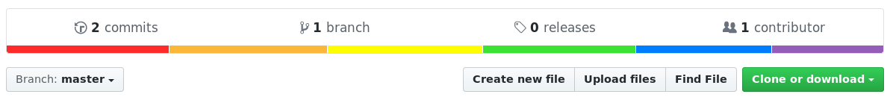

# LGBT

Just in case github changes any of the colours,
this is what it's supposed to look like:

## Similar projects

This repository has inspired various other pride flags ❤

- https://github.com/ticky/trans
- https://github.com/alexwlchan/asexual
- https://github.com/TartanLlama/non-binary
- https://github.com/issyl0/pan
